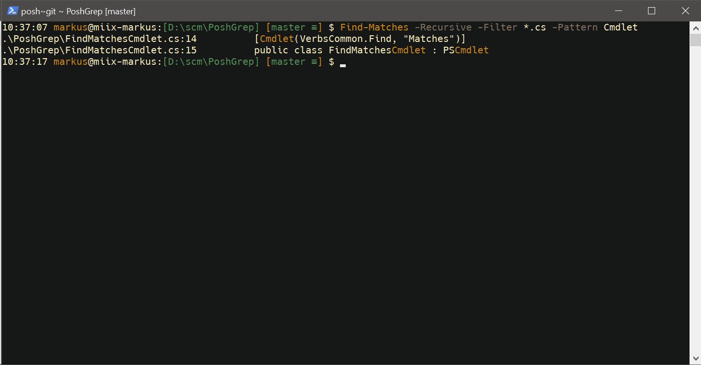
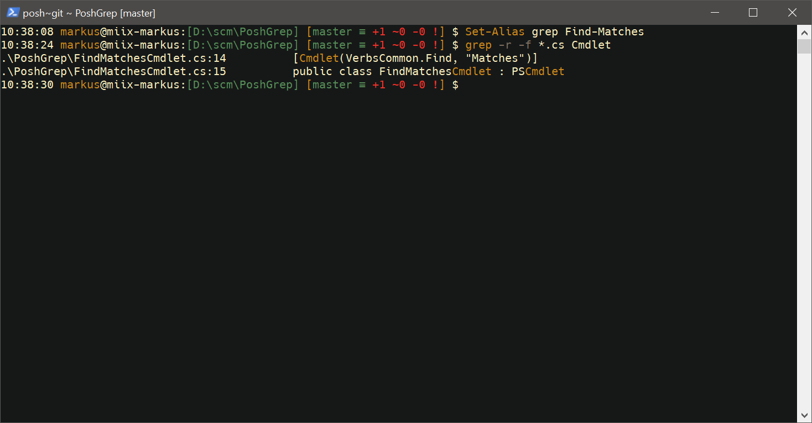

# PoshGrep

Just a small grep-like commandlet (not on feature par with original grep).

Served via [PowerShell Gallery](https://www.powershellgallery.com/packages/PoshGrep).

## Example with Find-Matches

## Example with alias

The names of the parameter are chosen to reflect some of the parameters that the original grep has.

